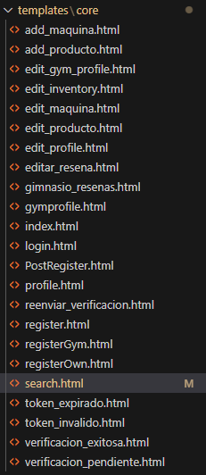

# Proyecto GMSearch

---

## **Integrantes:**

- Miguel Angel Arboleda – 2160253
- Alejandro Garzon – 2266088
- Santiago Useche Tascón – 2266200

---

## Objetivo

Este proyecto es realizado con el fin de permitir a las personas de la ciudad de Tuluá poder localizar gimnasios en su misma ciudad, de forma en que puedan tomar una decisión más acertada sin tener que desplazarse físicamente a cada uno para valorar la mejor opción para ellos. La pagina permite buscar por nombre o filtrar por diferentes aspectos tales como las valoraciones o cantidad de maquinas disponibles.

---

## Alcance:

1. **Gestión de Clientes**
2. **Gestión de Gimnasios**

## Historias de usuario

- Como usuario quiero poder registrar una cuenta con datos básicos para tener mi información personal en mi usuario. Para ello requiero un correo de confirmación inmediatamente después del registro.
- Como gestor de gimnasio quiero poder editar la información de mi gimnasio, para poder actualizar datos. Para ello es necesario un menú intuitivo para poder editar los datos de mi gimnasio.
- Como gestor de gimnasio quiero poder registrar las maquinas disponibles, para poder mostrar las ventajas de mi gimnasio. Para ello el sistema debe permitir registrar maquinas.
- Como usuario quiero que el sistema me agregue una rutina en dependencia de mi objetivo, para tener más organizado mi plan de ejercicio. Para ello el sistema debe recomendar una rutina al usuario dependiendo de su preferencia.
- Como usuario quiero buscar gimnasios disponibles, buscarlos por nombre o ubicación, para poder encontrar opciones de forma más cómoda. Para ello el sistema debe tener una interfaz de búsqueda y filtración de gimnasios.
- Como usuario quiero encontrar la información de contacto del gimnasio y/o poder registrar mi ingreso por medio de la página. Para ello el sistema debe guardar el registro de los usuarios a determinado gimnasio dentro de la base de datos.
- Como usuario quiero poder ver la rutina que tengo asignada, para verla cada día antes de ir a hacer ejercicio. Para ello el sistema debe tener una opción para visualizar la rutina del usuario.
- Como usuario quiero ver los precios de los gimnasios disponibles, para poder valorar cual me conviene más. Para ello el sistema debe tener registrados los precios de cada gimnasio y sus métodos de pago.
- Como gestor de gimnasio quiero poder registrar los productos que vendemos, para poder mostrar a los usuarios que cosas tenemos disponibles y ponerse en contacto para comprar. Para ello el sistema debe permitir agregar productos adicionales dentro de la información de cada gimnasio.

---

# Requerimientos

## Requerimientos funcionales

- Crear cuenta con datos básicos(nombre, dirección, correo, contraseña, teléfono)

- Inicio de sesión con los datos personales (usuario y contraseña)

- Crear/editar rutinas de cada gimnasio.
- Buscar gimnasios disponibles.
- Guardar el gimnasios favoritos en la cuenta.
- Visualizar rutinas de cada gimnasio.
- Registro de productos de cada gimnasio.
- Registrar y visualizar información de cada gimnasio.
- El sistema debe verificar la unicidad de los correos electrónicos registrados.
- El sistema debe enviar un correo de confirmación después del registro.

## Requerimientos no funcionales

- Seguridad: Encriptación de datos sensibles (contraseñas)
- Bajo tiempo de respuesta.
- Arquitectura cliente-servidor.
- Interfaz intuitiva.
- Asignación de permisos de usuario.
- El correo debe ser enviado al usuario inmediatamente después del registro.

---

# Apartado visual (front-end)

La pagina esta conectada a través de diferentes archivos tanto `css` y `html`, cada uno tiene su propio enlace dentro de `urls.py` dentro de la carpeta core.

```python
urlpatterns = [
    # Vistas HTML
    path('', views.index, name='index'),
    path('login-page/', views.login_page, name='login'),  # página de login HTML
    path('register-page/', views.register_page, name='register'),  # página de registro HTML
    path('register-own/', views.register_page, name='register_own'),
    path('register/', views.post_reg, name='post_reg'), #formulario que solicita datos adicionales al usuario
    path('profile', views.profile, name= "profile"),
    path('smart-profile/', views.smart_profile, name='smart_profile'),
    path('edit-profile/', views.edit_profile, name='edit_profile'),
    path('eliminar-cuenta-usuario/', views.eliminar_cuenta_usuario, name='eliminar_cuenta_usuario'),
    path('login-usuario/', views.login_usuario, name='login_usuario'),
    path('verificar-email/<str:token>/', views.verificar_email, name='verificar_email'),
    path('reenviar-verificacion/', views.reenviar_verificacion, name='reenviar_verificacion'),
    path('search/', views.search, name= 'search'),
    path('logout/', views.logout_view, name='logout'),
    path('register-gym/', views.register_gym, name='reg_gym'),
    path('gym-profile/<int:gimnasio_id>/', views.gym_profile, name='gym_profile'),
    path('edit-gym-profile/<int:gimnasio_id>/', views.edit_gym_profile, name='edit_gym_profile'),
    path('edit-inventory/<int:gimnasio_id>/', views.edit_inventory, name='edit_inventory'),
    path('add-maquina/<int:gimnasio_id>/', views.add_maquina, name='add_maquina'),
    path('add-producto/<int:gimnasio_id>/', views.add_producto, name='add_producto'),
    path('delete-maquina/<int:gimnasio_id>/<int:maquina_id>/', views.delete_maquina, name='delete_maquina'),
    path('delete-producto/<int:gimnasio_id>/<int:producto_id>/', views.delete_producto, name='delete_producto'),
    path('edit-maquina/<int:gimnasio_id>/<int:maquina_id>/', views.edit_maquina, name='edit_maquina'),
    path('edit-producto/<int:gimnasio_id>/<int:producto_id>/', views.edit_producto, name='edit_producto'),
    path('delete-gym-account/<int:gimnasio_id>/', views.delete_gym_account, name='delete_gym_account'),
    path('gimnasio-resenas/<int:gimnasio_id>/', views.gimnasio_resenas, name='gimnasio_resenas'),
    path('editar-resena/<int:gimnasio_id>/<int:resena_id>/', views.editar_resena, name='editar_resena'),
    path('eliminar-resena/<int:gimnasio_id>/<int:resena_id>/', views.eliminar_resena, name='eliminar_resena'),
    path('buscar/', views.buscar_gimnasios, name='buscar_gimnasios'),
    path('api/gimnasio/<int:gimnasio_id>/detalle/', views.gimnasio_detalle_api, name='gimnasio_detalle_api'),

    # Endpoints API
    path('api/', include(router.urls)),
    path('api/registro/', RegistroUsuarioView.as_view(), name='api_registro'),
    path('api/login/', LoginView.as_view(), name='api_login'),
    path('api/', include(router.urls)),
    
] + static(settings.MEDIA_URL, document_root=settings.MEDIA_ROOT)
```

Donde dentro de urlpatterns se referencia la url especifica para cada sección de la pagina web, además de que se gestiona las api, necesarias para algunos registros, tales como el manejo de reseñas, búsqueda de gimnasios, login, registro, entre otros.

posteriormente siendo estas referenciadas dentro del HTML correspondiente tal que:

```html
<a href="">Iniciar Sesión</a>
```

### HTML:

Las paginas mostradas al usuario están creadas utilizando `HTML`, de forma en que aparezca toda la información relevante para el usuario; La pagina superior se gestiona a través de 3 partes principales:

```html
<div class="top">
            <div class="nav" id="nav">
                <!-- Logo de casa para volver al inicio (mismo estilo que search.html) -->
                <a href="" class="home-icon" title="Volver al inicio">
                    <i class="fas fa-home"></i>
                </a>
                
                <!-- Botón toggle para mostrar/ocultar opciones -->
                <button class="toggle-options" id="toggleOptions">O></button>
                
                <!-- Opciones de búsqueda (ocultas por defecto) -->
                <ul class="links desktop-links" id="searchOptions">
                    <li><a href="?orden=productos">Más productos</a></li>
                    <li><a href="?orden=precio">Precios más bajos</a></li>
                    <li><a href="?orden=reseñas">Mejores reseñas</a></li>
                    <li><a href="?orden=maquinas">Mayor cantidad de máquinas</a></li>
                </ul>
            </div>
```

Encargado de  la parte superior del index

```html
<div class="signup">
                
                <!-- Botón Account unificado -->
                <div class="account-dropdown">
                    <button class="account-btn" id="accountBtn">
                        <span class="account-text">Account</span>
                        <div class="account-avatar">
                            
                                
                                    
                                        
                                    
                                        <i class="fas fa-dumbbell"></i>
                                    
                                
                                    <i class="fas fa-user"></i>
                                
                            
                                
                                    
                                
                                    <i class="fas fa-user"></i>
                                
                            
                        </div>
                    </button>
                    <div class="dropdown-menu" id="dropdownMenu">
                        <a href="" class="dropdown-item">
                            <i class="fas fa-user"></i>
                            Ver perfil
                        </a>
                        <a href="#" onclick="document.getElementById('logout-form').submit(); return false;" class="dropdown-item">
                            <i class="fas fa-sign-out-alt"></i>
                            Cerrar sesión
                        </a>
                    </div>
                    <form id="logout-form" method="post" action="" style="display: none;">
                            
                    </form>
                </div>
                
                <ul>
                    <li><a href="">Iniciar Sesión</a></li>
                    <li><a href="">Registrarse</a></li>
                </ul>
                
            </div>
        </div>
```

El gestiona el apartado de inicio de sesion, además de mostrar datos como el perfil en caso de que el usuario tenga una sesion iniciada.

```html
<div class="center">
            <div>
                <h1 class="h1">GMSearch</h1>
                
                <p>Bienvenido {{usuario.nombre}}, encuentra tu nuevo gimnasio </p>
                
                <p>El mejor sitio para buscar gimnasios</p>
                
            </div>
            <form method="get" action="">
                <input type="text" class="search" name="q" placeholder="Encuentra el gym ideal para ti...">
                <button type="submit" class="search-button">
                    <i class="fa fa-search" aria-hidden="true"></i>
                </button>
            </form>
        </div>
  
```

Encargado de la parte central del index donde se visualiza la barra de busqueda y el nombre de la pagina.

Además de esto, cada pagina se esta trabajando dentro de la carpeta “templates” de forma en que la estructura se visualiza de la siguiente forma:



Gestionando cada `HTML` de forma separada, posteriormente siendo todo conectado gracias al `Back-End` 

### CSS:

A través de CSS se gestionan los estilos de la pagina, lo cual podemos traducir en que es el encargado de que la pagina tenga un apartado visual más característico y no tan plano como es al utilizar `HTML` solo.

Cada `HTML` debe tener referenciado el archivo CSS al que se conecta de la siguiente forma:

```html
<link rel="stylesheet" href="">
```

Una de las partes principales a tener en cuenta dentro del CSS son los llamados @media 

```css
@media screen and (max-width: 768px) {
  .toggle-options {
    top: -25px;
    left: 60px;
    padding: 6px 10px;
    font-size: 12px;
  }
  
  .search-options {
    top: -25px;
    left: 120px;
    gap: 8px;
  }
  
  .option-link {
    padding: 6px 10px;
    font-size: 10px;
  }
  
  /* Ajustes para Account en móviles */
  .account-dropdown {
    top: -25px;
    right: 15px;
  }
  
  .account-btn {
    padding: 6px 12px;
    font-size: 12px;
    gap: 8px;
  }
  
  .account-avatar {
    width: 25px;
    height: 25px;
  }
  
  .account-avatar i {
    font-size: 14px;
  }
  
  .dropdown-menu {
    min-width: 160px;
  }
  
  .dropdown-item {
    padding: 10px 12px;
    font-size: 14px;
  }
  
  .auth-btn {
    padding: 6px 12px;
    font-size: 12px;
  }
  
  .titulo {
    margin-top: 60px;
  }
  
  .search-container {
    margin: 30px 0;
  }
  
  .resultados {
    margin-bottom: 30px;
  }
  
  .contenedor-gimnasios {
    padding: 40px;
  }
}

@media screen and (max-width: 480px) {
  .toggle-options {
    top: -30px;
    left: 50px;
    padding: 5px 8px;
    font-size: 11px;
  }
  
  .search-options {
    top: -30px;
    left: 100px;
    gap: 5px;
  }
  
  .option-link {
    padding: 4px 8px;
    font-size: 9px;
  }
  
  /* Ajustes para Account en pantallas muy pequeñas */
  .account-dropdown {
    top: -30px;
    right: 10px;
  }
  
  .account-btn {
    padding: 5px 10px;
    font-size: 11px;
    gap: 6px;
  }
  
  .account-avatar {
    width: 22px;
    height: 22px;
  }
  
  .account-avatar i {
    font-size: 12px;
  }
  
  .dropdown-menu {
    min-width: 140px;
  }
  
  .dropdown-item {
    padding: 8px 10px;
    font-size: 12px;
  }
  
  .auth-btn {
    padding: 5px 10px;
    font-size: 11px;
  }
  
  .titulo {
    margin-top: 50px;
  }
  
  .search-container {
    margin: 25px 0;
  }
  
  .resultados {
    margin-bottom: 25px;
  }
  
  .contenedor-gimnasios {
    padding: 35px;
  }
}
```

Utilizados para que según la pantalla sea más pequeña se pueda seguir visualizando de manera adecuada, especialmente útil para que se vea adaptada a dispositivos móviles. Garantizando de esta forma una responsividad adecuada.

El estilo de cada pagina se esta gestionando por medio de los archivos:


Todo esto dentro de la carpeta `Static/core/css` , además cada imagen utilizada como fondo debe ir dentro de la carpeta `img` .

### JavaScript:

Se utilizo java script para gestionar algunas funcionalidades menores, tales como el manejo de botones.

```jsx
document.addEventListener('DOMContentLoaded', () => {
    const menu = document.querySelector('.fa-bars');
    const linksDiv = document.querySelector('.links-div');
    menu.addEventListener('click', () => {
        linksDiv.classList.toggle('active');
    });
    document.addEventListener('click', (e) => {
        if (!linksDiv.contains(e.target) && !menu.contains(e.target)) {
            linksDiv.classList.remove('active');
        }
    });
    window.addEventListener('resize', () => {
        if (window.innerWidth > 580) {
            linksDiv.classList.remove('active');
        }
    });
});
```

Además de esto, JavaScript fue una pieza esencial en la busqueda de los gimnasios, permitiendo así desplegar una tarjeta flotante con el perfil del gimnasio, además de encargarse de el manejo de reseñas, de forma que funcionara bajo un sistema de estrellas de 0 a 5.

```jsx
<script>
document.addEventListener('DOMContentLoaded', function () {
    // Script para el botón toggle de opciones
    const toggleButton = document.getElementById('toggleOptions');
    const searchOptions = document.getElementById('searchOptions');
    let isVisible = false;

    toggleButton.addEventListener('click', function() {
        if (isVisible) {
            // Ocultar opciones
            searchOptions.style.display = 'none';
            toggleButton.textContent = 'O>';
            isVisible = false;
        } else {
            // Mostrar opciones
            searchOptions.style.display = 'flex';
            toggleButton.textContent = '-<';
            isVisible = true;
        }
    });

    // Script para el menú desplegable de Account
    const accountBtn = document.getElementById('accountBtn');
    const dropdownMenu = document.getElementById('dropdownMenu');
    let isDropdownOpen = false;

    if (accountBtn && dropdownMenu) {
        accountBtn.addEventListener('click', function(e) {
            e.stopPropagation();
            if (isDropdownOpen) {
                dropdownMenu.classList.remove('show');
                isDropdownOpen = false;
            } else {
                dropdownMenu.classList.add('show');
                isDropdownOpen = true;
            }
        });

        // Cerrar el menú al hacer clic fuera de él
        document.addEventListener('click', function(e) {
            if (!accountBtn.contains(e.target) && !dropdownMenu.contains(e.target)) {
                dropdownMenu.classList.remove('show');
                isDropdownOpen = false;
            }
        });
    }

    // Script existente para las cards
    document.querySelectorAll('.card').forEach(card => {
        card.addEventListener('click', function () {
            const gymId = this.getAttribute('data-id');

            if (!gymId) {
                console.warn("No se encontró el ID del gimnasio.");
                return;
            }

            fetch(`/api/gimnasio/${gymId}/detalle/`)
                .then(res => res.json())
                .then(data => {
                    const maquinasHtml = data.maquinas.map(m => `
                        <li><strong>${m.nombre}:</strong> ${m.descripcion || 'Sin descripción'}</li>
                    `).join('');
                    const productosHtml = data.productos.map(p => `
                        <li><strong>${p.nombre_prod}:</strong> ${p.descripcion || 'Sin descripción'} — $${p.precio}</li>
                    `).join('');

                    document.getElementById('modal-body').innerHTML = `
                        <h1>${data.nombre_gym}</h1>
                        

                        <p><strong>Ubicación:</strong> ${data.ubicacion}</p>
                        <p><strong>Precio inscripción:</strong> $${data.precio_inscripcion}</p>
                        <p><strong>Numero de contacto:</strong> ${data.numero || 'No disponible'}</p>
                        <p><strong>Descripción:</strong> ${data.descripcion}</p>
                        <p><strong>Calificación:</strong> ${data.calificacion} ⭐</p>

                        <h3>Máquinas disponibles:</h3> <ul>${maquinasHtml || '<li>No se registraron máquinas.</li>'}</ul>
                        <h3>Productos disponibles:</h3> <ul>${productosHtml || '<li>No se registraron productos.</li>'}</ul>

                        <h3>Califica este gimnasio:</h3>
                        <div id="rating-stars">
                            ${[1,2,3,4,5].map(num => `<i class="fa fa-star-o star" data-value="${num}" style="font-size: 24px; cursor: pointer;"></i>`).join('')}
                        </div>
                        <div style="margin-top: 15px;">
                            <label for="resena-texto" style="display: block; margin-bottom: 5px; font-weight: bold;">Reseña (opcional):</label>
                            <textarea id="resena-texto" placeholder="Escribe tu opinión sobre este gimnasio..." style="width: 100%; height: 80px; padding: 10px; border: 1px solid #ddd; border-radius: 5px; resize: vertical; font-family: inherit;"></textarea>
                        </div>
                        <button id="enviar-resena" style="margin-top: 10px;">Enviar Calificación</button>

                        <h3 style="margin-top: 30px; border-top: 2px solid #f0f0f0; padding-top: 20px;">Reseñas de otros usuarios:</h3>
                        <div id="resenas-container">
                            ${data.resenas && data.resenas.length > 0 ? 
                                data.resenas.map(resena => `
                                    <div style="background: #f9f9f9; border-radius: 8px; padding: 15px; margin-bottom: 15px; border-left: 4px solid #007bff;">
                                        <div style="display: flex; justify-content: space-between; align-items: center; margin-bottom: 10px;">
                                            <div style="display: flex; align-items: center; gap: 10px;">
                                                <span style="font-weight: bold; color: #333;">${resena.usuario_nombre}</span>
                                                <span style="color: #666; font-size: 12px;">
                                                    ${new Date(resena.fecha).toLocaleDateString('es-ES')}
                                                </span>
                                                ${resena.editado ? '<span style="color: #666; font-size: 12px; font-style: italic;">(editado)</span>' : ''}
                                            </div>
                                            <span style="color: #ffd700; font-size: 16px;">
                                                ${'★'.repeat(resena.estrellas)}${'☆'.repeat(5-resena.estrellas)}
                                            </span>
                                        </div>
                                        ${resena.texto ? 
                                            `<div style="color: #555; line-height: 1.4; font-style: italic;">"${resena.texto}"</div>` : 
                                            '<div style="color: #999; font-style: italic;">Sin comentario adicional</div>'
                                        }
                                        ${resena.es_mi_resena ? `
                                            <div style="display: flex; gap: 10px; margin-top: 15px;">
                                                <button onclick="editarResena(${gymId}, ${resena.id})" style="background: #28a745; color: white; border: none; padding: 8px 15px; border-radius: 5px; cursor: pointer; font-size: 14px;">
                                                    <i class="fa fa-edit"></i> Editar
                                                </button>
                                                <button onclick="confirmarEliminacionResena(${gymId}, ${resena.id})" style="background: #dc3545; color: white; border: none; padding: 8px 15px; border-radius: 5px; cursor: pointer; font-size: 14px;">
                                                    <i class="fa fa-trash"></i> Eliminar
                                                </button>
                                            </div>
                                        ` : ''}
                                    </div>
                                `).join('') : 
                                '<p style="color: #666; font-style: italic; text-align: center;">No hay reseñas para este gimnasio aún.</p>'
                            }
                        </div>
                    `;

                    document.getElementById('modal-gym').classList.remove('hidden');

                    let estrellasSeleccionadas = 0;
                    document.querySelectorAll('.star').forEach(star => {
                        star.addEventListener('click', function () {
                            estrellasSeleccionadas = parseInt(this.getAttribute('data-value'));
                            document.querySelectorAll('.star').forEach(s => {
                                s.classList.remove('selected');
                                s.classList.remove('fa-star');
                                s.classList.add('fa-star-o');
                            });
                            for (let i = 0; i < estrellasSeleccionadas; i++) {
                                const starElement = document.querySelectorAll('.star')[i];
                                starElement.classList.add('selected');
                                starElement.classList.remove('fa-star-o');
                                starElement.classList.add('fa-star');
                            }
                        });

                        // Efectos hover
                        star.addEventListener('mouseenter', function() {
                            const value = parseInt(this.getAttribute('data-value'));
                            document.querySelectorAll('.star').forEach((s, index) => {
                                if (index < value) {
                                    s.style.color = '#ffd700';
                                    s.style.transform = 'scale(1.1)';
                                }
                            });
                        });

                        star.addEventListener('mouseleave', function() {
                            document.querySelectorAll('.star').forEach((s, index) => {
                                if (!s.classList.contains('selected')) {
                                    s.style.color = '#ddd';
                                    s.style.transform = 'scale(1)';
                                }
                            });
                        });
                    });

                    document.getElementById('enviar-resena').addEventListener('click', () => {
                        if (!estrellasSeleccionadas) {
                            alert("Selecciona una cantidad de estrellas");
                            return;
                        }

                        const resenaTexto = document.getElementById('resena-texto').value.trim();

                        fetch('/api/resenas/', {
                            method: 'POST',
                            headers: {
                                'Content-Type': 'application/json',
                                'X-CSRFToken': getCSRFToken()
                            },
                            body: JSON.stringify({
                                gimnasio: gymId,
                                estrellas: estrellasSeleccionadas,
                                texto: resenaTexto
                            })
                        })
                        .then(res => {
                            if (res.ok) {
                                alert("¡Gracias por tu reseña!");
                                window.location.href = "/buscar/";
                            } else {
                                res.json().then(data => {
                                    alert("Solo se puede realizar una reseña por persona.");
                                });
                            }
                        })
                        .catch(err => {
                            alert("Ocurrió un error: " + err);
                        });
                    });
                }) 
                .catch(err => {
                    console.error("Error al cargar los datos:", err);
                });
        });
    });

    document.querySelector('.close-btn').addEventListener('click', () => {
        document.getElementById('modal-gym').classList.add('hidden');
    });
});

function getCSRFToken() {
    let name = 'csrftoken';
    let cookies = document.cookie.split(';');
    for (let i = 0; i < cookies.length; i++) {
        let c = cookies[i].trim();
        if (c.startsWith(name + '=')) {
            return decodeURIComponent(c.substring(name.length + 1));
        }
    }
    return null;
}

function editarResena(gymId, resenaId) {
    window.location.href = `/editar-resena/${gymId}/${resenaId}/`;
}

function confirmarEliminacionResena(gymId, resenaId) {
    if (confirm('¿Estás seguro de que quieres eliminar tu reseña? Esta acción no se puede deshacer.')) {
        eliminarResena(gymId, resenaId);
    }
}

function eliminarResena(gymId, resenaId) {
    fetch(`/eliminar-resena/${gymId}/${resenaId}/`, {
        method: 'POST',
        headers: {
            'X-CSRFToken': getCSRFToken()
        }
    })
    .then(res => {
        if (res.ok) {
            alert('Reseña eliminada correctamente');
            window.location.reload();
        } else {
            alert('Error al eliminar la reseña');
        }
    })
    .catch(err => {
        alert('Error: ' + err);
    });
}
</script>
```

---

# Back-end (Django)

La logica de GMSearch es manejada a traves de Django, este se encarga de gestionar la logica interna utilizando python como lenguaje principal de programacion.

El back-end se divide en varias secciones las cuales no solo garantizan una correcta implementacion de la arquitectura cliente-servidor, sino que además gestiona el enrutamiento correcto en el front-end, la conexión con la base de datos, el ingreso de datos a la base, la consulta de dichos datos, y el correcto funcionamiento de cada uno de los botones del front-end.

## Base de datos (sqlite3)

El programa gestiona el trafico de datos por medio de sqlite3, dentro del codigo MVP esto se almacena dentro de `settings.py` 

```racket
DATABASES = {
    'default': {
        'ENGINE': 'django.db.backends.sqlite3',
        'NAME': BASE_DIR / 'db.sqlite3',
    }
}
```

De forma que django locacliza correctamente la base de datos y le permite conectarse a las tablas y/o atributos relacionados a estas.

## Modelos

```racket
class UsuarioManager(BaseUserManager):
    def create_user(self, email, nombre, password=None, **extra_fields):
        if not email:
            raise ValueError('El correo electrónico es obligatorio.')
        email = self.normalize_email(email)
        user = self.model(email=email, nombre=nombre, **extra_fields)
        user.set_password(password)
        user.save(using=self._db)
        return user

    def create_superuser(self, email, nombre, password=None, **extra_fields):
        extra_fields.setdefault('is_staff', True)
        extra_fields.setdefault('is_superuser', True)

        return self.create_user(email, nombre, password, **extra_fields)

class Usuario(AbstractBaseUser, PermissionsMixin):
    email = models.EmailField(unique=True)
    nombre = models.CharField(max_length=100)
    edad = models.IntegerField(null=True, blank=True) 
    estatura = models.FloatField(null=True, blank=True)
    peso = models.FloatField(null=True, blank=True)
    sexo = models.CharField(max_length=10, choices=[('M', 'Masculino'), ('F', 'Femenino')], null=True, blank=True)
    foto_perfil = models.ImageField(upload_to='perfiles/', null=True, blank=True)
    direccion = models.CharField(max_length=255)
    telefono = models.CharField(max_length=20)
    es_dueño = models.BooleanField(default=False)
    #verificacion de email
    is_active = models.BooleanField(default=False)
    is_staff = models.BooleanField(default=False)
    email_verificado = models.BooleanField(default=False)
    token_verificacion = models.CharField(max_length=100, blank=True, null=True)
    fecha_token = models.DateTimeField(blank=True, null=True)

    objects = UsuarioManager()

    USERNAME_FIELD = 'email'
    REQUIRED_FIELDS = ['nombre']
    
    def __str__(self):
        return self.email
    
class Gimnasio(models.Model):
    codigo_gym = models.AutoField(primary_key=True)
    dueño = models.ForeignKey(Usuario, on_delete=models.CASCADE, related_name='gimnasios')
    nombre_gym = models.CharField(max_length=100)
    ubicacion = models.CharField(max_length=255)
    calificacion = models.FloatField(default=0)
    cantidad_resenas = models.IntegerField(default=0) 
    precio_inscripcion = models.DecimalField(max_digits=8, decimal_places=2)
    descripcion = models.TextField()
    vistas = models.IntegerField(default=0)
    imagen = models.ImageField(upload_to='gimnasios/', null=True, blank=True)

    def __str__(self):
        return self.nombre_gym

class ClienteGimnasio(models.Model):
    usuario = models.ForeignKey(Usuario, on_delete=models.CASCADE, related_name='gimnasios_inscritos')
    gimnasio = models.ForeignKey(Gimnasio, on_delete=models.CASCADE, related_name='clientes')

    class Meta:
        unique_together = ('usuario', 'gimnasio')

    def __str__(self):
        return f"{self.usuario.email} inscrito en {self.gimnasio.nombre_gym}"

class Favorito(models.Model):
    usuario = models.ForeignKey(Usuario, on_delete=models.CASCADE, related_name='favoritos')
    gimnasio = models.ForeignKey(Gimnasio, on_delete=models.CASCADE, related_name='favorito_por')

    class Meta:
        unique_together = ('usuario', 'gimnasio')

    def __str__(self):
        return f"{self.usuario.email} → {self.gimnasio.nombre_gym}"

    
class Maquina(models.Model):
    gimnasio = models.ForeignKey(Gimnasio, on_delete=models.CASCADE, related_name='maquinas')
    nombre = models.CharField(max_length=100)
    descripcion = models.TextField()

    def __str__(self):
        return self.nombre

class Inventario(models.Model):
    codigo_prod = models.AutoField(primary_key=True)
    gimnasio = models.ForeignKey(Gimnasio, on_delete=models.CASCADE, related_name='productos')
    nombre_prod = models.CharField(max_length=100)
    descripcion = models.TextField()
    precio = models.DecimalField(max_digits=8, decimal_places=2)

    def __str__(self):
        return self.nombre_prod
    
class Reseña(models.Model):
    gimnasio = models.ForeignKey(Gimnasio, on_delete=models.CASCADE, related_name='resenas')
    usuario = models.ForeignKey(Usuario, on_delete=models.CASCADE)
    estrellas = models.IntegerField(choices=[(i, str(i)) for i in range(6)])
    texto = models.TextField(max_length=500, blank=True, null=True, help_text="Reseña opcional (máximo 500 caracteres)")
    fecha = models.DateTimeField(auto_now_add=True)
    editado = models.BooleanField(default=False)
    fecha_edicion = models.DateTimeField(null=True, blank=True)

    class Meta:
        unique_together = ('usuario', 'gimnasio')

    def save(self, *args, **kwargs):
        # Si ya existe una reseña y se está actualizando, marcar como editado
        if self.pk:
            self.editado = True
            from django.utils import timezone
            self.fecha_edicion = timezone.now()
        
        # Guardar la reseña
        super().save(*args, **kwargs)
```

En `models.py` se manejan las tablas que Django interpreta correctamente para posteriormente integrarlas dentro de la base de datos. Dentro de las tablas disponibles las principales son:

- `Usuarios:` Encargada de gestionar la información de los usuarios, almacena datos como su nombre, apellidos, numero de teléfono, peso, sexo, su foto de perfil, etc.
- `Gimnasios:` Encargada de gestionar la información de los gimnasios, almacenando datos como una foto de su exterior, nombre, ubicacion, precio de inscripcion, descripcion.
- `Maquina:` Encargado de almacenar las maquinas disponibles de cada gimnasio, siendo conectado a estos a través de una llave foranea.
- `Inventario:` Encargado de almacenar los productos a la venta de cada gimnasio, conectado a través de una llave foranea.
- `Reseña:` Encargado de almacenar las reseñas de los usuarios, con calificacion, fecha de realizacion, nombre del usuario que la almaceno y gimnasio a la que va relacionada.

## Vistas

Las vistas son las funciones dentro de `views.py` encargadas de que la logica en `python` funcione correctamente, esta recibe todas las peticiones y formularios enviados desde el front-end y las interpreta de forma en que acceda correctamente a la base de datos.

```python
def buscar_gimnasios(request):  
    query = request.GET.get('q', '')
    orden = request.GET.get('orden', '')

    if query:
        gimnasios = Gimnasio.objects.filter(nombre_gym__icontains=query)
        if not gimnasios.exists():
            gimnasios = Gimnasio.objects.all()
    else:
        gimnasios = Gimnasio.objects.all()
    
    if orden == 'precio':
        gimnasios = gimnasios.order_by('precio_inscripcion')
    elif orden == 'reseñas':
        gimnasios = gimnasios.annotate(promedio=Avg('resenas__estrellas')).order_by('-promedio')
    elif orden == 'maquinas':
        gimnasios = gimnasios.annotate(num_maquinas=Count('maquinas')).order_by('-num_maquinas')
    elif orden == 'productos':
        gimnasios = gimnasios.annotate(num_productos=Count('productos')).order_by('-num_productos')
    return render(request, 'core/search.html', {'query': query, 'gimnasios': gimnasios,  'orden': orden,})

def recomendar_gimnasio(request):
    # Obtener los 5 gimnasios con mejor calificación
    gimnasios_recomendados = Gimnasio.objects.order_by('-calificacion')[:5]

    gimnasios_listados = {
        'gimnasios_recomendados': gimnasios_recomendados
    }
    return render(request, 'core/index.html', gimnasios_listados)
    
def login_page(request):
    return render(request, 'core/login.html')

@ensure_csrf_cookie
def register_page(request):
    if request.method == 'POST':
        tipo = request.POST.get('tipo_usuario')
        nombre = request.POST['nombre']
        email = request.POST['email']
        password = request.POST['password']
        confirm_password = request.POST.get('confirm_password')
        
        # Validar que las contraseñas coincidan
        if password != confirm_password:
            return render(request, 'core/register.html', {'error': 'Las contraseñas no coinciden'})
        
        # Validar que el correo no esté registrado
        if Usuario.objects.filter(email=email).exists():
            return render(request, 'core/register.html', {'error': 'Este correo electrónico ya está registrado'})
        
        # Generar token de verificación
        token = secrets.token_urlsafe(32)
        fecha_expiracion = timezone.now() + timedelta(hours=24)
        
        usuario = Usuario.objects.create(
            nombre=nombre,
            email=email,
            password=make_password(password),
            token_verificacion=token,
            fecha_token=fecha_expiracion,
            es_dueño=(tipo == 'dueño')
        )
        
        # Enviar email de verificación
        send_mail(
            'Verifica tu cuenta en GMSearch',
            f'Por favor, verifica tu cuenta haciendo clic en el siguiente enlace:\n\n'
            f'http://{request.get_host()}/verificar-email/{token}/\n\n'
            f'Este enlace expirará en 24 horas.',
            settings.DEFAULT_FROM_EMAIL,
            [email],
            fail_silently=False,
        )
        
        return render(request, 'core/verificacion_pendiente.html')
    if 'register-own' in request.path: #en caso de que el registro venga por parte de un dueño de gimnasio toma los datos del html correspondiente
        return render(request, 'core/registerOwn.html')
    return render(request, 'core/register.html')
```

Cada accion que se quiera realizar en la pagina debe de pasar por una vista para que esta verifique y almacene el formulario enviado por el usuario, garantizando el aplicar la aquitectura cliente-servidor.

## Filtros

Utilizados en `filters.py` se encarga de filtrar informacion de forma en que facilite una consulta especifica.

```python
class GimnasioFilter(filters.FilterSet):
    precio_inscripcion = filters.RangeFilter()
    calificacion = filters.NumberFilter(field_name='calificacion', lookup_expr='gte')
    ubicacion = filters.CharFilter(field_name='ubicacion', lookup_expr='icontains')

    class Meta:
        model = Gimnasio
        fields = ['ubicacion', 'precio_inscripcion', 'calificacion']

```

## Verificacion de correo

```python
EMAIL_BACKEND = 'django.core.mail.backends.smtp.EmailBackend'
EMAIL_HOST = 'smtp.sendgrid.net'
EMAIL_PORT = 587
EMAIL_USE_TLS = True
EMAIL_HOST_USER = 'apikey'  # ¡literalmente esta palabra!
EMAIL_HOST_PASSWORD = os.environ.get('SENDGRID_API_KEY')
if not EMAIL_HOST_PASSWORD:
    raise Exception('SENDGRID_API_KEY no está definida en las variables de entorno')
DEFAULT_FROM_EMAIL = 'gymsearch.www@gmail.com'  # o tu correo verificado en SendGrid
MEDIA_URL = '/media/'
MEDIA_ROOT = BASE_DIR / 'media'
```

```python
def verificar_email(request, token):
    try:
        usuario = Usuario.objects.get(token_verificacion=token)
        if usuario.fecha_token and usuario.fecha_token > timezone.now():
            usuario.email_verificado = True
            usuario.is_active = True
            usuario.token_verificacion = None
            usuario.fecha_token = None
            usuario.save()
            
            # Redirigir a la página de login con mensaje de éxito
            context = {
                'es_dueño': usuario.es_dueño,
                'nombre_usuario': usuario.nombre
            }
            return render(request, 'core/verificacion_exitosa.html', context)
        else:
            return render(request, 'core/token_expirado.html')
    except Usuario.DoesNotExist:
        return render(request, 'core/token_invalido.html')
```

```python
def reenviar_verificacion(request):
    """Vista para reenviar el email de verificación"""
    if request.method == 'POST':
        email = request.POST.get('email')
        try:
            usuario = Usuario.objects.get(email=email)
            if not usuario.email_verificado:
                # Generar nuevo token de verificación
                token = secrets.token_urlsafe(32)
                fecha_expiracion = timezone.now() + timedelta(hours=24)
                
                usuario.token_verificacion = token
                usuario.fecha_token = fecha_expiracion
                usuario.save()
                
                # Enviar email de verificación
                send_mail(
                    'Verifica tu cuenta en GMSearch',
                    f'Por favor, verifica tu cuenta haciendo clic en el siguiente enlace:\n\n'
                    f'http://{request.get_host()}/verificar-email/{token}/\n\n'
                    f'Este enlace expirará en 24 horas.',
                    settings.DEFAULT_FROM_EMAIL,
                    [email],
                    fail_silently=False,
                )
                
                return render(request, 'core/verificacion_pendiente.html', {
                    'mensaje': 'Se ha reenviado el email de verificación. Revisa tu bandeja de entrada.'
                })
            else:
                return render(request, 'core/verificacion_pendiente.html', {
                    'error': 'Este correo ya está verificado.'
                })
        except Usuario.DoesNotExist:
            return render(request, 'core/verificacion_pendiente.html', {
                'error': 'No se encontró una cuenta con este correo electrónico.'
            })
    
    return render(request, 'core/reenviar_verificacion.html')
```

El sistema implementa un proceso de verificación de correo electrónico para garantizar la autenticidad de las cuentas de usuario. Este proceso se divide en varias partes:

### Configuración SMTP

En el archivo de configuración se establece la conexión con el servicio de envío de correos electrónicos SendGrid:

- **EMAIL_BACKEND:** Utiliza el backend SMTP de Django para enviar correos.
- **EMAIL_HOST:** Configura el servidor SMTP de SendGrid.
- **EMAIL_PORT y EMAIL_USE_TLS:** Establecen el puerto y el uso de cifrado TLS para la comunicación segura.
- **EMAIL_HOST_USER y EMAIL_HOST_PASSWORD:** Credenciales para autenticar con SendGrid, utilizando una clave API almacenada en variables de entorno.

### Proceso de Verificación

Durante el registro de usuario en la función `register_page`, el sistema:

1. Genera un token único utilizando `secrets.token_urlsafe(32)` para cada usuario.
2. Establece un período de validez de 24 horas para el token (`fecha_expiracion = timezone.now() + timedelta(hours=24)`).
3. Envía un correo electrónico con un enlace de verificación que incluye el token generado.
4. Cuando el usuario hace clic en el enlace, la función `verificar_email` valida el token y activa la cuenta si es válido.

### Reenvío de Verificación

La función `reenviar_verificacion` permite a los usuarios solicitar un nuevo correo de verificación si no recibieron el original o si el token expiró. El proceso incluye:

- Búsqueda del usuario por su correo electrónico.
- Generación de un nuevo token y actualización de la fecha de expiración.
- Envío de un nuevo correo electrónico con el enlace de verificación actualizado.

Este sistema de verificación añade una capa de seguridad importante al proceso de registro, asegurando que los usuarios tienen acceso a las direcciones de correo electrónico que proporcionan y reduciendo la posibilidad de cuentas falsas o spam en la plataforma.

## Serializers

```python
class UsuarioSerializer(serializers.ModelSerializer):
    class Meta:
        model = Usuario
        fields = ['id', 'email', 'nombre', 'direccion', 'telefono', 'es_dueño', 'password']
        extra_kwargs = {'password': {'write_only': True}}

    def validate_email(self, value):
        if Usuario.objects.filter(email=value).exists():
            raise serializers.ValidationError("Este correo ya está registrado.")
        return value

    def create(self, validated_data):
        validated_data['password'] = make_password(validated_data['password'])
        usuario = Usuario.objects.create(**validated_data)
        send_mail(
            'Confirmación de Registro',
            'Gracias por registrarte en nuestro sistema.',
            'Gimnasio Web',
            [usuario.email],
            fail_silently=False,
        )
        return usuario
```

Los`serializers` utilizan la API `REST Framework` . Se encargan de convertir objetos complejos de Python, como instancias de modelos, en tipos de datos nativos de Python que luego pueden ser fácilmente convertidos a formato JSON. También proporcionan deserialización, permitiendo convertir datos en formato JSON a objetos complejos de Python.

 Los `serializers` cumplen varias funciones importantes como:

- **Conversión de datos:** Transforman objetos de modelos de Django (como `Usuario` o `Gimnasio`) en representaciones JSON que pueden ser enviadas como respuestas a peticiones API.
- **Validación de datos:** Como podemos observar en el `UsuarioSerializer`, incluyen métodos como `validate_email` que verifican la validez de los datos antes de procesar la solicitud.
- **Creación y actualización de objetos:** Mediante métodos como `create`, manejan la lógica de creación de nuevos registros en la base de datos, incluyendo operaciones adicionales como el cifrado de contraseñas.

## Tests

Las pruebas implementadas en el proyecto utilizan `pytest` y el framework de pruebas de Django para garantizar el correcto funcionamiento de los diferentes componentes del sistema.

```python
@pytest.fixture
def usuario_existente(db):
    return Usuario.objects.create(
        email="existente@example.com",
        nombre="Usuario Existente",
        direccion="Calle Real 456",
        telefono="987654321",
        es_dueño=False,
        password=make_password("passwordseguro")
    )

@pytest.mark.django_db
def test_registro_usuario_email_duplicado(usuario_existente):
    client = APIClient()
    payload = {
        "email": "existente@example.com",  # Mismo email que la fixture
        "nombre": "Otro Nombre",
        "direccion": "Otra Dirección",
        "telefono": "111111111",
        "es_dueño": False,
        "password": "otra_pass"
    }

    response = client.post("/api/registro/", payload)  # Usa el endpoint real
    assert response.status_code == 400
    assert "email" in str(response.data).lower()

@pytest.mark.django_db
def test_registro_usuario_email_duplicado():
    client = APIClient()
    Usuario.objects.create(
        email="duplicado@example.com",
        nombre="Usuario Duplicado",
        direccion="Calle 1",
        telefono="000000000",
        es_dueño=False,
        password=make_password("password123")  # encriptación manual
    )

    payload = {
        "email": "duplicado@example.com",
        "nombre": "Nuevo Nombre",
        "direccion": "Nueva Dirección",
        "telefono": "111111111",
        "es_dueño": False,
        "password": "otra_pass"
    }

    response = client.post("/api/registro/", payload)
    assert response.status_code == 400
    assert "email" in str(response.data).lower()

class UsuarioModelTest(TestCase):

    def test_crear_usuario(self):
        user = Usuario.objects.create_user(
            email='prueba@example.com',
            nombre='Juan Pérez',
            password='password123'
        )
        self.assertEqual(user.email, 'prueba@example.com')
        self.assertTrue(user.check_password('password123'))
        self.assertFalse(user.is_staff)

    def test_crear_superusuario(self):
        admin = Usuario.objects.create_superuser(
            email='admin@example.com',
            nombre='Admin User',
            password='adminpass'
        )
        self.assertTrue(admin.is_superuser)
        self.assertTrue(admin.is_staff)

class FichaBiometricaModelTest(TestCase):

    def setUp(self):
        self.user = Usuario.objects.create_user(
            email='ficha@example.com', nombre='Ficha User', password='pass'
        )

    def test_crear_ficha_biometrica(self):
        ficha = FichaBiometrica.objects.create(
            usuario=self.user, altura=1.75, peso=70.5
        )
        self.assertEqual(ficha.altura, 1.75)
        self.assertEqual(ficha.usuario.email, 'ficha@example.com')

class GimnasioModelTest(TestCase):

    def setUp(self):
        self.owner = Usuario.objects.create_user(
            email='dueno@example.com', nombre='Dueño', password='pass'
        )

    def test_crear_gimnasio(self):
        gym = Gimnasio.objects.create(
            dueño=self.owner,
            nombre_gym='Gym Test',
            ubicacion='Ciudad',
            precio_inscripcion=100.00,
            descripcion='Un gimnasio de prueba',
        )
        self.assertEqual(gym.nombre_gym, 'Gym Test')
        self.assertEqual(gym.dueño.email, 'dueno@example.com')

class ClienteGimnasioModelTest(TestCase):

    def setUp(self):
        self.user = Usuario.objects.create_user(
            email='cliente@example.com', nombre='Cliente', password='pass'
        )
        self.gym = Gimnasio.objects.create(
            dueño=self.user,
            nombre_gym='Gym Test',
            ubicacion='Ciudad',
            precio_inscripcion=50.00,
            descripcion='Gym Test Desc',
        )

    def test_cliente_inscripcion_unica(self):
        ClienteGimnasio.objects.create(usuario=self.user, gimnasio=self.gym)
        with self.assertRaises(IntegrityError):
            ClienteGimnasio.objects.create(usuario=self.user, gimnasio=self.gym)

class FavoritoModelTest(TestCase):

    def setUp(self):
        self.user = Usuario.objects.create_user(
            email='fav@example.com', nombre='Favorito', password='pass'
        )
        self.gym = Gimnasio.objects.create(
            dueño=self.user,
            nombre_gym='Gym Fav',
            ubicacion='Ciudad',
            precio_inscripcion=80.00,
            descripcion='Desc',
        )

    def test_favorito_unico(self):
        Favorito.objects.create(usuario=self.user, gimnasio=self.gym)
        with self.assertRaises(IntegrityError):
            Favorito.objects.create(usuario=self.user, gimnasio=self.gym)

```

### Estructura de las Pruebas

- **Fixtures:** Se utilizan fixtures como `usuario_existente` para crear objetos reutilizables en múltiples pruebas, optimizando el código y evitando repeticiones.
- **Pruebas de Registro:** Verifican que no se puedan registrar usuarios con correos electrónicos duplicados, asegurando la integridad de los datos.
- **Pruebas de Modelos:** Se prueban las funcionalidades básicas de cada modelo como `Usuario`, `FichaBiometrica`, `Gimnasio`, entre otros.
- **Pruebas de Integridad:** Casos como `test_cliente_inscripcion_unica` y `test_favorito_unico` comprueban que no se puedan crear registros duplicados en relaciones específicas.

Además de estas pruebas unitarias automatizadas, se realizaron pruebas manuales para verificar la experiencia del usuario y el funcionamiento correcto de la interfaz web en diferentes escenarios.

---

# Manual Técnico

## Requisitos previos:

- Python 3.8+
- Django 3.2+
- Django REST Framework
- SQLite (por defecto) o PostgreSQL (en producción)

## Pasos de instalación:

1. Clonar el repositorio: `git clone &lt;url-del-repositorio&gt;`
2. Crear un entorno virtual: `python -m venv env`
3. Activar el entorno virtual:
    - Windows: `env\Scripts\activate`
    - Linux/Mac: `source env/bin/activate`
4. Instalar dependencias: `pip install -r requirements.txt`
5. Aplicar migraciones: `python manage.py migrate`
6. Crear superusuario: `python manage.py createsuperuser`
7. Correr el servidor de desarrollo: `python manage.py runserver`

## Endpoints API Principales

| **Endpoint** | **Función** |
| --- | --- |
| POST /api/registro/ | Registro de usuarios |
| POST /api/login/ | Autenticación de usuarios |
| CRUD /api/gimnasios/ | Gestión de gimnasios |
| CRUD /api/rutinas/ | Gestión de rutinas |
| CRUD /api/inventario/ | Gestión de inventario |
| CRUD /api/maquinas/ | Gestión de máquinas |

---

# Manual de Usuario

## Para Clientes:

1. Registrarse en la plataforma
    - Ingrese a la página principal y haga clic en "Registrarse"
    - Complete el formulario con su correo y contraseña
2. Verifique su cuenta
    - Revise su correo electrónico y haga clic en el enlace de confirmación
    - Este enlace expirará en 24 horas
3. Inicie sesión con sus credenciales
4. Complete su perfil con datos biométricos para mejorar las recomendaciones
5. Busque gimnasios
    - Use la barra de búsqueda para encontrar por nombre
    - Aplique filtros por ubicación, precio o calificación
6. Califique gimnasios
    - Califíquelo de 0 a 5 estrellas según su experiencia de usuario
    - Añada una reseña de que le pareció el gimnasio
7. Póngase en contacto con el gimnasio de su preferencia y comience a entrenar!

## Para Dueños de Gimnasios:

1. Regístrese como dueño
    - Al registrarse, seleccione la opción "Es dueño de gimnasio"
    - Complete la verificación adicional requerida
2. Configure su gimnasio
    - Añada información detallada: nombre, ubicación, horarios
    - Suba fotos del establecimiento y descripciones
    - Configure precios y promociones
3. Gestione su catálogo
    - Registre las máquinas disponibles con fotos y descripciones
    - Añada productos a su inventario con precios
4. Cree rutinas personalizadas para sus clientes
5. Monitoree las estadísticas
    - Vea el número de visitas a su perfil
    - Consulte cuántos usuarios lo han añadido a favoritos
    - Revise las reseñas y calificaciones de los usuarios

**Nota:** La interfaz web de GMSearch está optimizada para ser completamente responsiva, funcionando perfectamente tanto en computadoras como en dispositivos móviles.